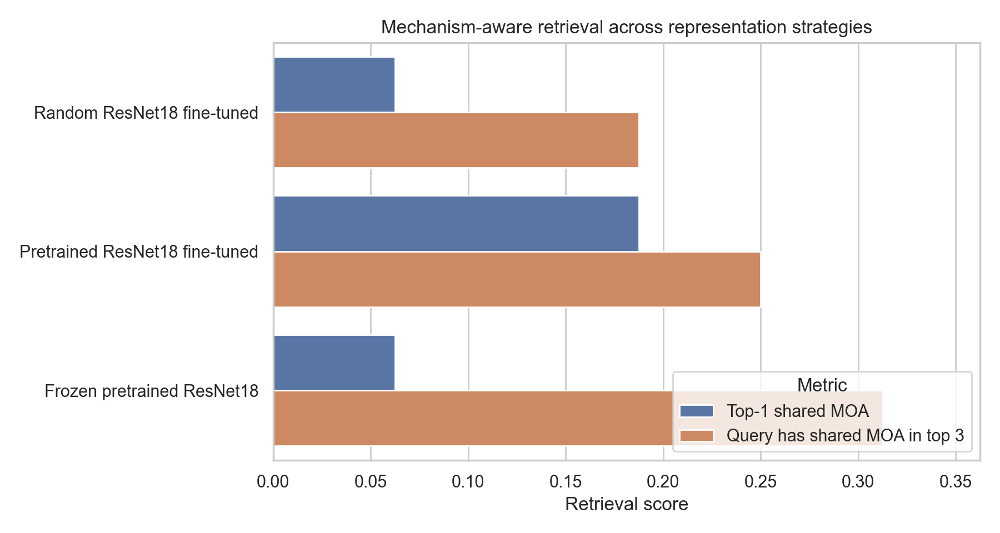
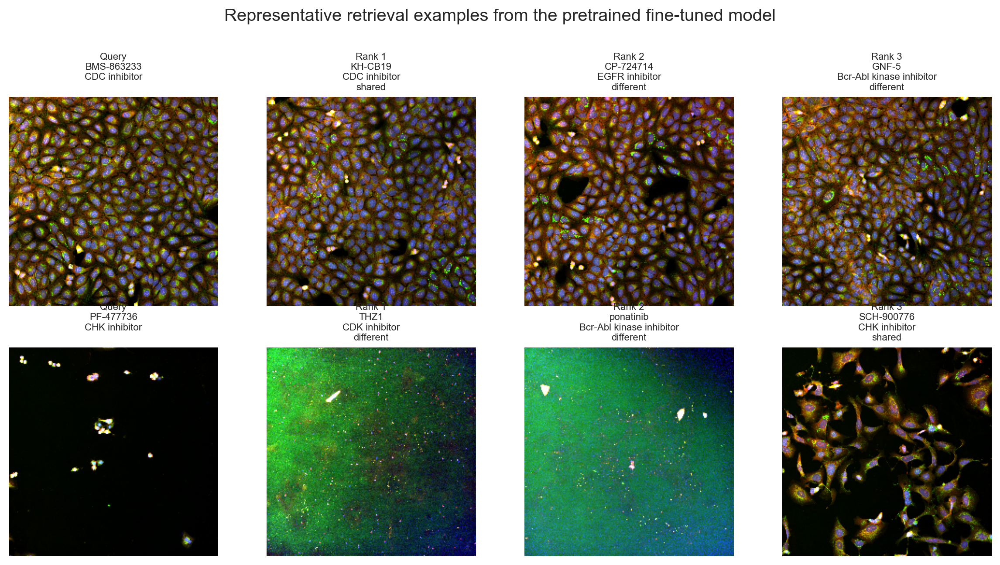
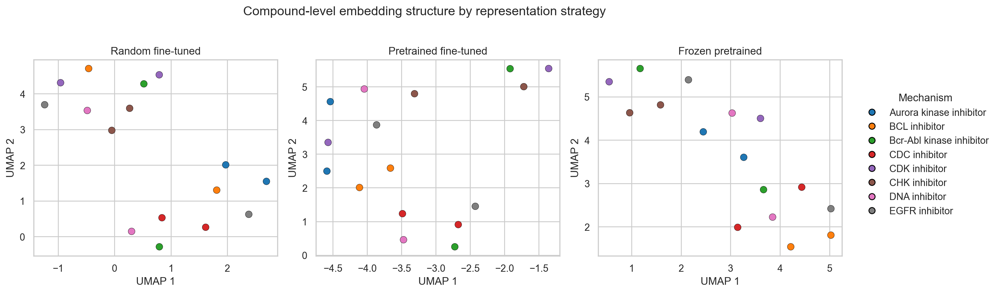
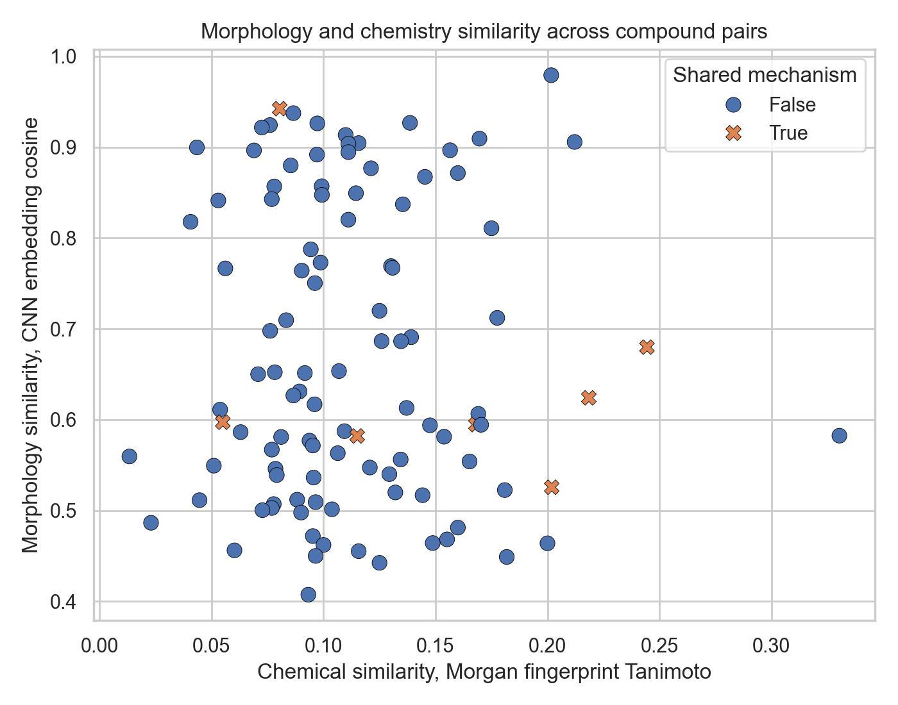
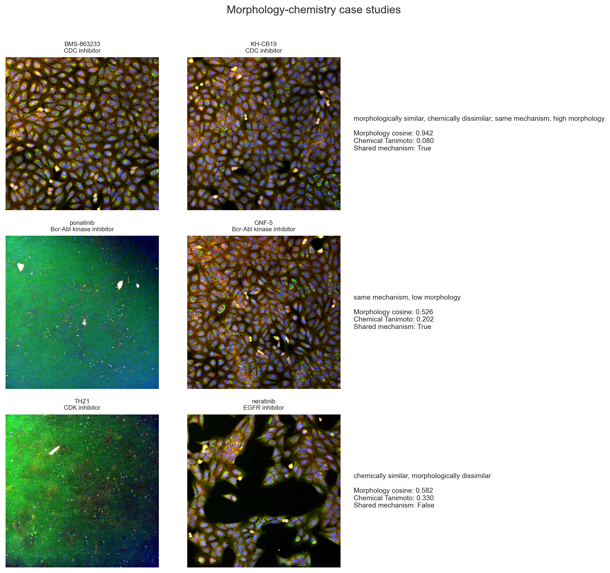

# Final Report

## Project Objective

This project evaluates whether Cell Painting microscopy images can be used to build phenotypic fingerprints for mechanism-aware compound retrieval. The analysis asks whether CNN-derived morphology embeddings recover known mechanism-of-action relationships and whether morphology similarity provides information that is distinct from chemical structure similarity.

## Dataset

The analysis uses the `cpg0002-jump-scope` JUMP-MOA Cell Painting dataset. The final benchmark subset contains:

```text
8 mechanism-of-action classes
2 compounds per mechanism
12 image sites per compound
192 image records
960 channel-level image files
```

Each image record contains five fluorescence channels:

```text
RNA, Mito, AGP, ER, DNA
```

The benchmark uses compound-holdout validation. For each mechanism, one compound is used for training and one compound is held out for validation. This split tests whether the representation generalizes across compounds within the same mechanism rather than memorizing replicate images from the same compound.

## Workflow

The project implements the following workflow:

```text
metadata normalization
image download and validation
multi-channel image loading
CNN representation learning
image-level embedding extraction
compound-level fingerprint aggregation
nearest-neighbor phenotypic retrieval
morphology-chemistry comparison
case-study visualization
```

The main unit of analysis is the compound-level fingerprint. Individual image embeddings are averaged across image sites to create one morphology fingerprint per compound.

## Representation Benchmark

Three representation strategies were compared:

| Experiment | Validation accuracy | Top-1 shared MOA | Query has shared MOA in top 3 |
|---|---:|---:|---:|
| Random ResNet18 fine-tuned | 0.1250 | 0.0625 | 0.1875 |
| Pretrained ResNet18 fine-tuned | 0.1667 | 0.1875 | 0.2500 |
| Frozen pretrained ResNet18 | NA | 0.0625 | 0.3125 |

The pretrained fine-tuned ResNet18 model produced the strongest top-1 retrieval result. The frozen pretrained ResNet18 representation produced the strongest top-3 query coverage. This suggests that fine-tuning can sharpen selected nearest-neighbor matches, while frozen pretrained features may preserve broader morphology structure.



## Retrieval Examples

The pretrained fine-tuned model retrieved one clear mechanism-consistent example:

```text
BMS-863233, CDC inhibitor -> KH-CB19, CDC inhibitor at rank 1
```

It also produced an imperfect but informative case:

```text
PF-477736, CHK inhibitor -> THZ1, CDK inhibitor at rank 1
PF-477736, CHK inhibitor -> SCH-900776, CHK inhibitor at rank 3
```

These examples show that local morphology matches can recover mechanism signal, but recovery is not consistent across all held-out compounds.



## Embedding Structure

UMAP projections were generated for the random fine-tuned, pretrained fine-tuned, and frozen pretrained compound fingerprints. The projections are diagnostic rather than confirmatory. They show that mechanism-level separation is limited, which agrees with the modest retrieval metrics.



## Morphology-Chemistry Comparison

Chemical similarity was computed from SMILES using RDKit Morgan fingerprints and Tanimoto similarity. Morphology similarity was computed from pretrained fine-tuned compound fingerprints using cosine similarity.

The chemistry analysis included 15 compounds with valid SMILES and produced 105 compound pairs.

The strongest morphology-chemistry disagreement case was:

```text
BMS-863233 and KH-CB19
mechanism: CDC inhibitor
morphology cosine: 0.942
chemical Tanimoto: 0.080
```

This pair is important because it shows the value of phenotypic profiling. Two compounds can be chemically dissimilar but produce a similar cellular phenotype. This supports the use of Cell Painting embeddings as a complementary signal for drug discovery.

The strongest same-mechanism low-morphology case was:

```text
ponatinib and GNF-5
mechanism: Bcr-Abl kinase inhibitor
morphology cosine: 0.526
chemical Tanimoto: 0.202
```

This case illustrates the opposite limitation. Shared mechanism annotations do not guarantee similar Cell Painting profiles in a small image subset.





## Main Conclusion

The project supports a representation-centered interpretation. The full pipeline works, from Cell Painting image loading through CNN embedding extraction, compound fingerprint aggregation, nearest-neighbor retrieval, and morphology-chemistry comparison. The current biological signal is real but limited by dataset scale, compound diversity, and generic image representations.

The most important result is not a high classification score. The main contribution is a reproducible phenotypic similarity search workflow that connects microscopy images, mechanism labels, and chemical structure similarity.

## Limitations

The benchmark subset is small. It contains only 16 compounds for representation comparison and 15 compounds with valid SMILES for morphology-chemistry analysis. This limits statistical power and makes individual examples sensitive to subset selection.

The CNN models use generic ImageNet-pretrained ResNet18 features rather than bioimage-specific pretraining. This is likely a major representation bottleneck.

The analysis uses mechanism-of-action labels as the main biological annotation. These labels are useful but coarse. Compounds with the same annotation can differ in potency, target engagement, off-target activity, treatment response, and downstream cellular state.

## Future Work

The most meaningful extensions are:

```text
expand to a larger compound set
compare against CellProfiler-style morphology features
test bioimage-specific pretrained models
train self-supervised Cell Painting representations
add target-level and pathway-level retrieval evaluation
perform batch and plate effect diagnostics
```

These extensions would test whether the current morphology-chemistry findings hold at larger scale.
